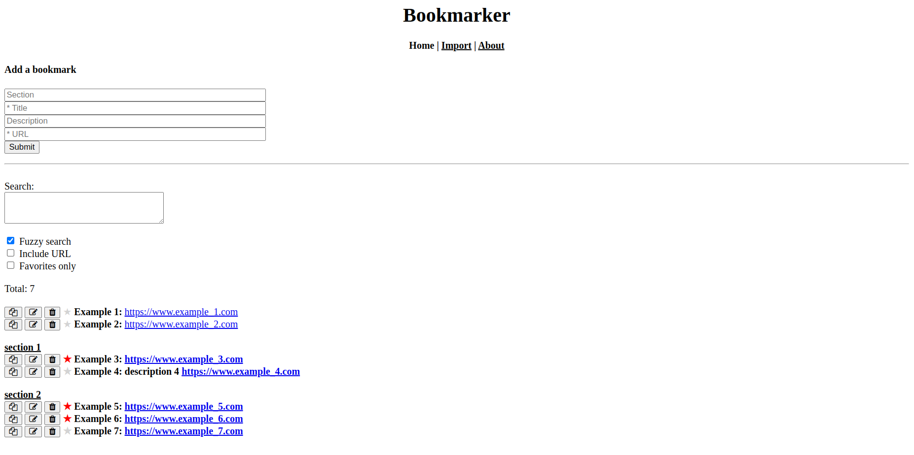

# Bookmarker

A productivity self-hosted tool to store and browse bookmarks.

<kbd>
  
</kbd>

#### Privacy

Bookmarks are stored locally in a [SQLite](https://www.sqlite.org/index.html) database.
This is useful when you don't want to expose sensitive data that may appear in URLs
(e.g., bookmarks in your workplace) with third-party tools.
Note that it is recommended to periodically back up the SQLite file.

#### Cross-browser

The tool can run on any browser and enables you to share the bookmarks across all your browsers,
so you can switch browsers as much as you like and still have all your bookmarks available.

#### Search

The tool has a strong search capabilities which enable you to easily and quickly find bookmarks.

- Fuzzy search: It supports a fuzzy search (can be turned off/on)
so you don't have to remember the exact name or description of the bookmark.

- Search-as-you-type: Bookmarks are filtered as you type and matching characters are highlighted
(sections are also highlighted however search doesn't work on them).

- URLs can be very long which makes fuzzy search inefficient. Therefore there is a `Include URL` option
(if turned off, matching characters in URLs are still highlighted however URLs don't affect search results).

#### Import bookmarks

You can import existing bookmarks from your browser.
All major browsers are supported
(tested with Google Chrome, Firefox, Safari and Microsoft Edge).
To do so, export your bookmarks to an HTML file, go to the `Import` page in the menu and import your bookmarks.
Canonical folders will be converted into `/`-delimiter sections.


## Installation

##### Requirements:

1. Python 3.7 or higher

##### Linux / macOS:

1. Create a directory named `venv`
2. Run:
```
python -m venv <route/to/venv-directory>
source <route/to/venv-directory>/bin/activate
pip install -r requirements.txt
```

##### Windows:

1. Create a directory named `venv`
2. Run:
```
python -m venv  <route\to\venv-directory>
<route\to\venv-directory>\Scripts\activate.bat
pip install -r requirements.txt
```

## Running the application

1. Activate the virtual environment: `source venv/bin/activate`
2. Run `python src/main.py`
3. From the browser: `http://localhost:8000`

## Tests

This project is well tested with unittests and end-to-end tests. The code coverage is 98%.

The `build.py` script runs the following static code analysis and test suites:
- pycodestyle (pep8)
- pylint
- Unit tests
- End-to-end tests

To run `build.py`:
1. Activate the virtual environment: `source venv/bin/activate`
2. Install dev dependencies: `pip install -r requirements_dev.txt`
3. Run: `PYTHONPATH=src python build.py`

To check coverage:
1. `PYTHONPATH=src coverage run --concurrency=multiprocessing build.py`
2. `coverage combine`
3. `coverage html`
4. Open `htmlcov/index.html` in your browser
